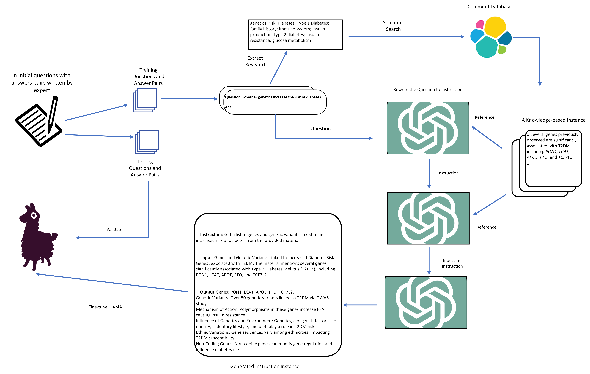
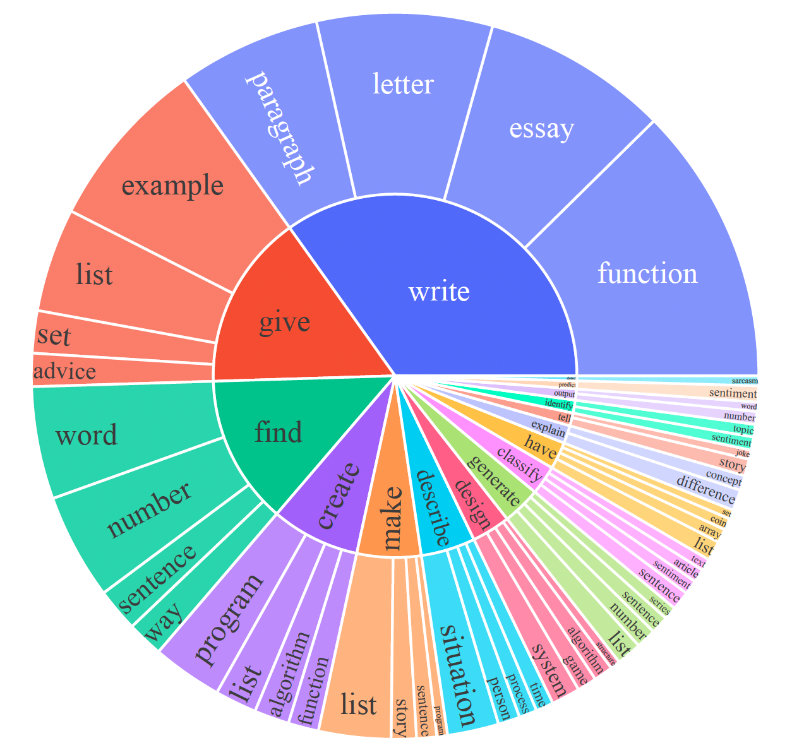

# Domain-specific Instructions Generation
This repository provides the source code for generating domain-specific instructions instance for fine-tuning LLM.

## Implementation Detail

### 1. Data Collection

Collect the questions and corresponding answer, it should be written by the expert.

1. We will first check the vanilla model performance over the questions set compared to the expert response.
2. The dataset(if sufficient) will be split into test set and training set, we will finally check the model performance (few-shot ability) over the test set.

### 2. Knowledge Retrieval

For each question, search database and find a **knowledge instance **(KI), a KI is defined as a chunks of word(separated by \n) from the literatures and guidelines. The implementation detail is as follow:

1. Extract the keyword from both questions and answers.
2. Search the keyword through our database(elastic search).
3. Select the instance that similar score over a threshold.
4. Concat the result.

### 3. Generate Instruction

Rewrite the question to different downstream tasks, the implementation detail is as follow:

1. Create a database for storing the instance(PostgreSQL?)
2. Design the template for rewriting using the verb root for each downstream task.
3. Store to the database along with the corresponding KI

### 4. Generate Input and Output

Based on the generated instruction we generate the output and input similar to [self-instruct](https://arxiv.org/abs/2212.10560), the implementation detail is as follow:

1. Might skip classification determination just like what alpaca have done.
2. Design template(we need to re-design the template since we want to add the KI into the template.
3. We will first generate input and then output.

##  Some Potential Obstacle 

1. The KI retrieved from database is too long, even though they are relevant.
2. Some verb root is not reasonable for some certain reference or the generated instruction is not semantically consistent with the original question.
3. How do we do the filtering to exclude those unreasonable instance.
4. Cost consideration.
5. Template design.

